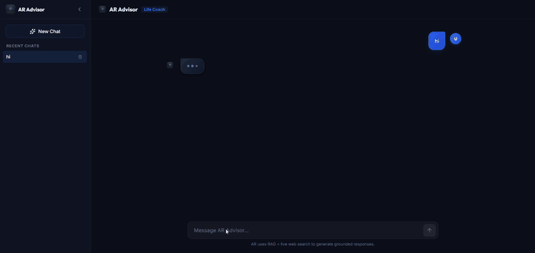
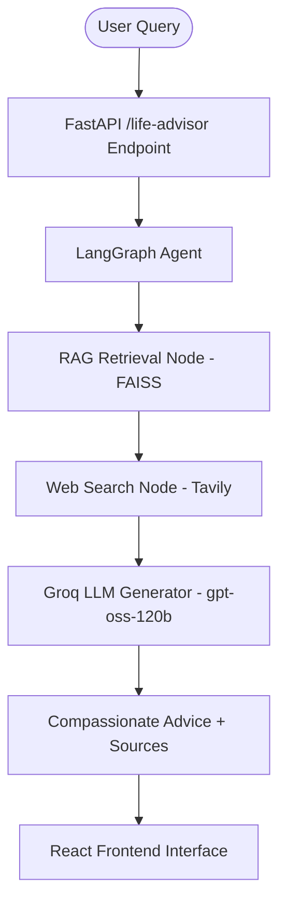

# ⏳ Time & Lifestyle Agent

> **AI-Powered Life Alignment Coach ("AR")** — Helping individuals balance purpose, family, health, finances, time management, and sustainable habit building using **LangGraph**, **RAG (FAISS)**, **Groq LLM**, and **Tavily Web Search**.

---

## 🎬 Demo



---

## ✨ Features

- 🧠 **Empathetic AI Life Alignment Coach**: Provides compassionate, structured, and practical advice tailored to personal struggles.
- 📚 **RAG (Retrieval-Augmented Generation)**: Leverages a local FAISS vector store with HuggingFace embeddings (`sentence-transformers/all-mpnet-base-v2`) for curated self-improvement & lifestyle guidance.
- 🌐 **Real-time Web Search Integration**: Dynamically queries the web using Tavily Search API when local context is insufficient.
- ⚡ **Ultra-Fast Groq LLM Inference**: Powered by `openai/gpt-oss-120b` running on Groq hardware.
- 🎨 **Modern React Web Dashboard**: Interactive, responsive frontend built with React 19, Vite, and Lucide React icons.

---

## 🏗️ Architecture & Workflow

The agent runs on a **LangGraph** stateful graph architecture:



---

## 📁 Repository Structure

```text
time_lifestyle_agent/
├── assets/
│   └── demo.gif             # Demo screen recording GIF
├── data/                    # Source documents for knowledge base
├── vectorstores/            # FAISS vector database index files
├── src/                     # Backend core implementation
│   ├── embedding.py         # Embedding & FAISS vector store creation
│   ├── state.py             # LangGraph state schema definition
│   ├── nodes.py             # RAG, Web Search, & Groq generator nodes
│   └── graph.py             # LangGraph compiled execution graph
├── main.py                  # FastAPI application & REST endpoint
├── pyproject.toml           # Python dependencies (managed via uv)
├── .env                     # Local environment secrets & API keys
└── frontend/                # React + Vite frontend workspace
    ├── package.json
    ├── vite.config.js
    └── src/
        ├── App.jsx          # Main chat dashboard component
        └── index.css        # Styling
```

---

## 🛠️ Prerequisites

Before getting started, ensure you have the following installed on your machine:

- **Python**: `3.12` or higher
- **`uv`**: Fast Python package manager (or standard `pip` / `venv`)
- **Node.js**: `v18+` and `npm`
- **API Keys Required**:
  - [Groq API Key](https://console.groq.com/)
  - [Tavily API Key](https://tavily.com/)
  - [HuggingFace Token](https://huggingface.co/settings/tokens) *(optional / recommended)*

---

## ⚙️ Setup & Installation

### 1. Clone the Repository

```bash
git clone https://github.com/Aswin-RajR/Lifestyle-Agent.git
cd Lifestyle-Agent
```

### 2. Configure Environment Variables

Create a `.env` file in the root project directory:

```env
GROQ_API_KEY=your_groq_api_key_here
TAVILY_API_KEY=your_tavily_api_key_here
HF_TOKEN=your_huggingface_token_here
```

### 3. Install Backend Dependencies

Using **`uv`** *(Recommended)*:

```bash
uv sync
```

*Or using standard `pip`:*

```bash
python -m venv .venv
# On Windows:
.venv\Scripts\activate
# On Linux/macOS:
source .venv/bin/activate

pip install -e .
```

### 4. Install Frontend Dependencies

```bash
cd frontend
npm install
cd ..
```

---

## 🚀 Running the Application

### Step 1: Start the Backend API Server

From the root directory:

```bash
uv run uvicorn main:api --reload --port 8000
```

> The FastAPI backend will run at **`http://localhost:8000`**. You can access interactive API docs at `http://localhost:8000/docs`.

### Step 2: Start the Frontend Application

In a new terminal window, navigate to `frontend`:

```bash
cd frontend
npm run dev
```

> The React development server will start at **`http://localhost:5173`**.

Open your browser and navigate to `http://localhost:5173` to start chatting with your AI Life Alignment Coach!

---

## 🔌 API Endpoint Reference

### `POST /life-advisor`

#### Request Body
```json
{
  "user": "I am struggling to manage my work schedule and spend time with my family."
}
```

#### Response Body
```json
{
  "final_message": "...",
  "sources": [
    "data/time_management_guide.txt",
    "https://example.com/work-life-balance"
  ]
}
```

---

## 🧑‍💻 Author

Developed with ❤️ by **Aswin Raj**
